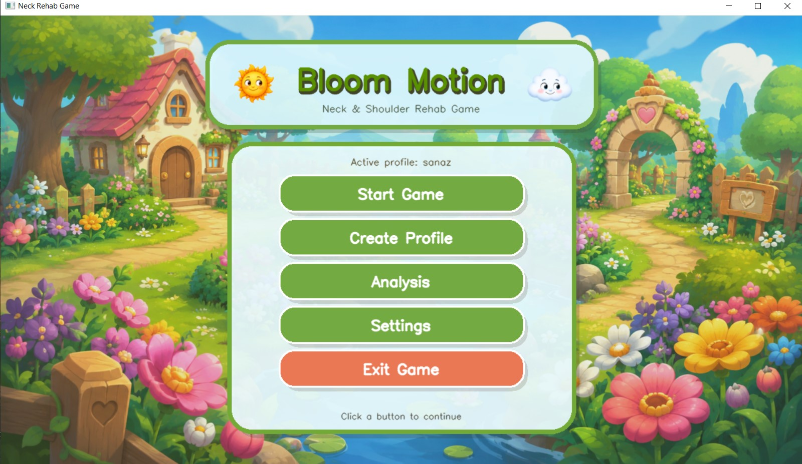

# Bloom Motion: Vision-Based Gamified Rehabilitation

A **webcam-based, sensor-free rehabilitation system** for guided neck and scapular exercises using computer vision, personalized calibration, and real-time markerless movement tracking.

Bloom Motion was developed as a research prototype to explore how therapeutic neck and scapular movements can be integrated into an interactive game environment using only a conventional webcam.

## Overview

The system tracks facial, upper-body, and hand landmarks in real time and maps therapeutic movements to events inside a garden-themed rehabilitation game.

Before gameplay, each user completes an individualized calibration procedure. The system records the user's neutral posture and target movement patterns so that movement detection can be adapted to differences in body size, camera position, posture, and individual range of motion.

During gameplay, detected movements control a sun/cloud character and trigger visual events such as navigation, flower growth, cloud transformation, and rainfall.

## Supported Movements

| Movement                       | Function in the Game        |
| ------------------------------ | --------------------------- |
| Neck Flexion                   | Character navigation        |
| Neck Extension                 | Character navigation        |
| Left Side Bend                 | Character navigation        |
| Right Side Bend                | Character navigation        |
| Chin Tuck                      | Flower growth               |
| Scapular Elevation             | Sun-to-cloud transformation |
| Palm-Based Scapular Retraction | Rain activation             |

## Key Features

* Real-time webcam-based movement tracking
* No wearable sensors or external motion-tracking hardware required
* Personalized movement calibration
* Face, pose, and bilateral hand landmark tracking
* Movement-specific visual feedback
* Time-based therapeutic movement holds
* Multiple game stages and progressive challenges
* User profile management
* Session and movement-performance recording
* Post-session analysis and progress visualization

## System Workflow

1. Create or load a user profile.
2. Record neutral posture.
3. Calibrate target neck and scapular movements.
4. Start the rehabilitation game.
5. Use calibrated neck movements to navigate the character.
6. Reach a target location in the game.
7. Perform the required therapeutic movement sequence.
8. Receive immediate visual feedback.
9. Record movement and session performance.
10. Continue until the game objective is completed.

## Personalized Calibration

Rather than using the same fixed movement thresholds for every user, Bloom Motion records participant-specific neutral and target positions.

The calibration procedure includes:

* Neutral posture
* Neck flexion
* Neck extension
* Left lateral bending
* Right lateral bending
* Chin tuck
* Scapular elevation
* Palm-based scapular retraction

For angle-based neck movements, individualized thresholds are derived from the user's calibrated range of motion.

Chin tuck, scapular elevation, and scapular retraction are evaluated using multidimensional landmark-based feature representations rather than a single anatomical angle.

## Computer Vision Pipeline

The prototype is implemented in **Python** and uses:

* **OpenCV** — webcam acquisition, image processing, and visualization
* **MediaPipe Face Mesh** — facial landmark tracking and head-related movement analysis
* **MediaPipe Pose** — upper-body and shoulder landmark tracking
* **MediaPipe Hands** — bilateral hand and palm tracking
* **NumPy** — numerical processing and feature calculations
* **Pygame** — optional audio support

The graphical game environment is rendered at **1280 × 720** pixels.

## Movement Detection

### Neck Flexion and Extension

Head-pose information relative to the calibrated neutral position is used to detect forward and backward neck movement.

### Lateral Neck Bending

Left and right lateral bending are estimated from changes in eye-line orientation relative to the user's calibrated neutral posture.

### Chin Tuck

Chin tuck is represented using a multidimensional normalized facial-feature vector based on relative positions and distances among facial landmarks.

### Scapular Elevation

Scapular elevation is detected from bilateral shoulder displacement relative to facial reference landmarks and normalized using shoulder width.

### Palm-Based Scapular Retraction

Because direct scapular displacement is difficult to measure reliably using a single conventional webcam, bilateral palm movement is used as an indirect visual cue.

The algorithm considers features including palm separation, outward displacement, hand geometry, and upper-body landmarks.

## Preliminary Evaluation

The research prototype underwent a preliminary evaluation with:

* **40 participants**
* **Age range:** 19–55 years
* **48 recorded sessions**
* **40 completed sessions**
* **5 abandoned sessions**
* **3 sessions interrupted by connection loss**

The overall session completion rate was **83.3%**.

### Movement-Specific Performance

| Movement            |  Accuracy | Angular Error |
| ------------------- | --------: | ------------: |
| Scapular Elevation  |     92.3% |             — |
| Extension           |     88.1% |         12.9° |
| Scapular Retraction |     87.8% |             — |
| Chin Tuck           |     87.1% |             — |
| Flexion             |     74.1% |         18.1° |
| Right Side Bend     |     67.8% |         20.3° |
| Left Side Bend      |     61.3% |         22.8° |
| **Macro Average**   | **79.8%** |    **18.5°*** |

* Mean angular error was calculated only across the four angle-based neck movements.

The reported accuracy represents conformity with each participant's individualized calibrated movement pattern and should not be interpreted as externally validated clinical movement-detection accuracy.

## Installation

Clone the repository:

```bash
git clone https://github.com/sanazabbasnejad/vision-based-gamified-rehabilitation.git
cd vision-based-gamified-rehabilitation
```

Install the required Python packages:

```bash
pip install -r requirements.txt
```

Run the application:

```bash
python bloom_motion.py
```

> Some graphical and audio assets used by the complete research prototype may not be included in the public repository.

## Privacy

Local user profiles and session data are intentionally excluded from version control.

The `.gitignore` configuration prevents locally generated rehabilitation-session data from being uploaded to the public repository.

## Research Status

This repository contains the implementation associated with the research project:

**A Vision-Based Gamified Rehabilitation System for Neck and Scapular Exercises**

**Authors:**
Sanaz Abbasnejad, Mohammadreza Akhbari, Kobra Pirmohammadi, Hadis Sadat Momeni Rad, and Rasoul Abedi

Department of Biomedical Engineering, Amirkabir University of Technology (Tehran Polytechnic)

## Research Disclaimer

Bloom Motion is a **research prototype** intended for investigation of computer-vision-assisted rehabilitation and interactive exercise guidance.

The current results represent preliminary technical and feasibility evaluation. Further external validation and clinically standardized evaluation are required before conclusions about therapeutic effectiveness can be made.

## Author

**Sanaz Abbasnejad**
B.Sc. Candidate in Biomedical Engineering — Bioelectric Engineering
Amirkabir University of Technology (Tehran Polytechnic)

Research interests: Rehabilitation Engineering, Computer Vision, Eye Tracking, Biomedical Signal Processing, and Machine Learning in Healthcare.


## Interface Gallery

The following screenshots show representative interfaces and stages of the Bloom Motion rehabilitation system.

### Main Menu



### Interface Screenshot 1


### Interface Screenshot 2


### Interface Screenshot 3


### Interface Screenshot 4


### Interface Screenshot 5


### Interface Screenshot 6


### Stage Selection


### Training Stage


### Summer Pots Stage


